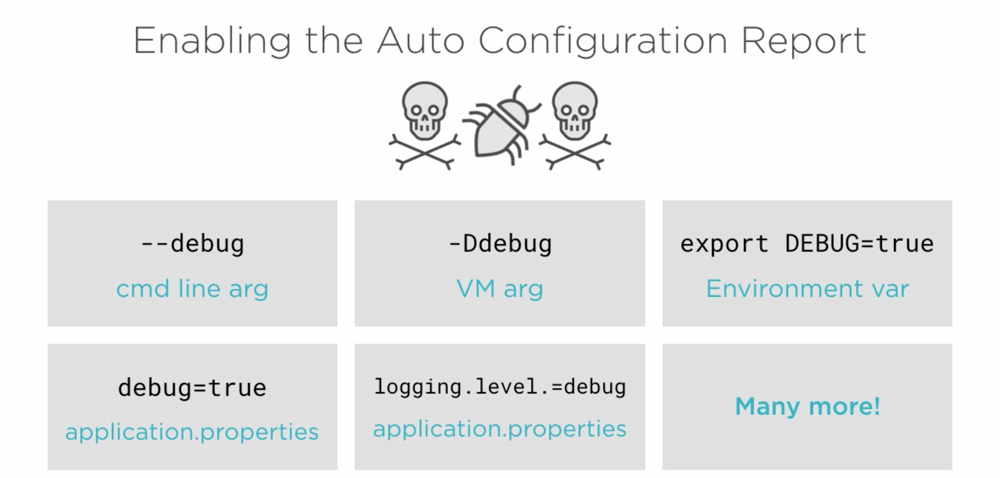

# General overview:

you need the devtools dependencies for live reload

it can do browser reload with plugins

you can set additional-paths to watch or not to watch.

## TOPICS

1. TESTING
   Why test:
   - Verifiy correctness of code.
   - Document behaviour (How system behaves when the there are errors as well)
   - Detect regression (We are not breaking existing functionality)

- Ways of making tests easier:

  - Following SOLID principles.
  - Using dependency injection.
    - better ways of doing D.I for good testing.
      - Constructor injection.
      - Setter injection (When dependecy is optional)
      - Using builder patterns

## Unit tests runs in isolation

- Mocks:
  - types of mock:
    - dummy: when dependency is not checked
    - stub: when dependecy needs to fulfill a condition

## Integration test

---

# 2. CONFIGURATION

### Guides

The following guides illustrate how to use some features concretely:

- [Building a RESTful Web Service](https://spring.io/guides/gs/rest-service/)
- [Serving Web Content with Spring MVC](https://spring.io/guides/gs/serving-web-content/)
- [Building REST services with Spring](https://spring.io/guides/tutorials/bookmarks/)
- [Building a RESTful Web Service with Spring Boot Actuator](https://spring.io/guides/gs/actuator-service/)

## Configurations

- Use devtools to reload
- set multipart.max-size
- set multipart.max-request-size

### Config is done with the following:

- Presence or absence of:
  - A jar
  - bean
  - property

there are others but these are the main ones necessary for configuring our application

- Positive matches
- Negative matches
- exclusions: THings configured by you not be configured regardless of any conditions
- Unconditional classes: regardles of any condition, they would be configured

Here are the ways we can enable autoconfiguration report:

You can exclude autoconfiguration with the `exclude`(use the class name) and `excludeName`(uses string classpath) argument to the enableautoconfigure annotation

or use property spring.autoconfigure.exlude = classpath

You can ovveride the PropertySourcesPlaceholderConfigurer

We can also exlcude the JMXAutoconfiguration, JacksonAutoconfiguration, WebsocketAutoconfiguration

## @ConditionOnClass

- Name and Value

## @ConditionOnMissingClass

- Name only

## @ConditionalOnBean

## @ConditionOnMissingBean

## @ConditionalOnPropery

# 3. SECURITY

By adding the starter dependency, you have a default login and registrtion page set up for you.

> DEMO: add security to the todo application.

- `/login` will log you in with username: `user` password: it is printed on the console.

- `/logout` will log the user out

### Configure the security process

To configure how spring boot handle the security you have to create a class that would override the abstract WebSecurityConfigurerAdapter class and implement the various method necessary. (Check the demo)

if there is an error in loggin in, then you sent to `/login?error` if you are logged out, then you will be redirected to `/login?logout`

## configure the security

To configure the security you need to extend the WebSecurityConfigurerAdapter abstract class.

## Auth

_https://www.youtube.com/watch?v=3pZ3Nh8tgTE_

Spring provides various authentication filters/managers

- e.g Openidauthfilter, basicauthfilter, digestauthfilter
- auth manager returns token to the authfilter. it delegates to one or more providers e.g openidauthprovider, daoauthprovider, ldapauthprovider (mostly use one, but big organizations use more than one.)
- the providers use a userdetailsservice to retreive the credentials from and identity store

different kinds of authentication:

- form login
- digest auth
- basic auth

---

## Security Protocols:

- Oauth2: is not authentication or authorization. It is "delegated authorization" and has its flaws, which include impersonation.
- Open ID Connect (OIDC)

  - features of oidc is identity token: is a jwt(json web token), contains claims of how the authentication occured by the authorization server

    ## features:

    - must contain a unique subject which assert the identity of the user (non reassignable)
    - issuer: issuing authority (client can verify the user was authenticated by the expected source)
    - audience: client that was authenticate (client id).
    - expiration time:
    - issued at:

    - scope: this contains specific claims
      - openid, email, profile, offline access, custom scopes

4. DEPLOYMENT

5. SPRING CLOUD

# sort orders and contacts.

# search orders and contacts

# show company names on the orders or contacts table list
